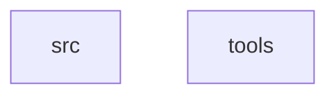

# PROJECT ARCHITECTURE (架构视图)

> **Context**: 自动生成的项目依赖关系图。
> **Tags**: `@ARCH` `@GRAPH`
<!-- NIKI_VERSION: 0.1.0 -->

## 1. Module Dependency Graph
> Generated by `ndoc graph` based on analysis.

<!-- NIKI_AUTO_DOC_START -->

<!-- NIKI_AUTO_DOC_END -->

## 2. Analysis
*   **Nodes**: Modules found in source directories.
*   **Edges**: `A --> B` means A depends on B.

## 3. Custom Notes (用户自定义)
*   User manual edit test.
