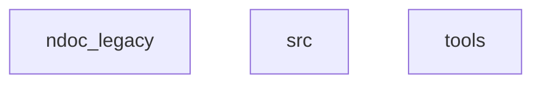

# PROJECT ARCHITECTURE
> @CONTEXT: 架构设计 | 策略 | @TAGS: @ARCH @FLOW

<!-- NIKI_VERSION: 2.0.0 -->

## @OVERVIEW
**Niki-docAI 2.0 (Rebirth)** 是一个文档驱动、函数式且以数据为中心的工具，旨在为 AI 编程助手维护 "Live Context" (实时上下文)。它摒弃了传统的 OOP，转而采用清晰的 **Data Pipeline** (数据管道) 架构。

## @VISION
*   **Data > Objects**: 状态 (State) 作为明确的数据结构传递，而不是隐藏在类实例中。
*   **Functions > Methods**: 逻辑实现为纯函数 (Pure Functions) 或隔离的副作用原子 (Side-effect Atoms)。
*   **Docs > Code**: 文档定义系统；代码仅仅是执行代理。

## @LAYER
系统严格分层。依赖关系 **向下** 流动 (Entry -> Flows -> Atoms -> Models)。

### Layer 1: Models (`src/ndoc/models`)
*   **Responsibility**: 纯数据定义。
*   **Type**: `dataclass` 或 `TypedDict`。
*   **Constraint**: 无逻辑，无方法（简单 helper 除外），无副作用。
*   **Example**: `ProjectConfig`, `FileContext`, `Violation`。

### Layer 2: Atoms (`src/ndoc/atoms`)
*   **Responsibility**: 原子能力与 IO 隔离。
*   **Type**: 纯函数或副作用包装器。
*   **Modules**:
    *   `io.py`: 文件读写 (磁盘 IO 发生的唯一场所)。
    *   `fs.py`: 目录遍历，路径操作 (Scanner)。
    *   `text.py`: 正则模式，字符串解析。
*   **Constraint**: 领域无关 (Domain-agnostic)。可被任何其他项目复用。

### Layer 3: Flows (`src/ndoc/flows`)
*   **Responsibility**: 业务逻辑管道。
*   **Type**: 函数式管道。
*   **Pattern**: `Input(Context) -> Process -> Output(Result)`。
*   **Modules**:
    *   `map_flow.py`: 生成 `_MAP.md`。
    *   `tech_flow.py`: 生成 `_TECH.md`。
    *   `verify_flow.py`: 检查规则。
*   **Constraint**: 无状态 (Stateless)。所有上下文通过参数传递。

### Layer 4: Entry (`src/ndoc/entry.py`)
*   **Responsibility**: 组装与执行。
*   **Actions**:
    1.  Load Config (加载配置模型)。
    2.  Build Context (构建上下文)。
    3.  Dispatch to Flow (分发至流程)。
    4.  Print Result (输出结果)。

## @FLOW (Data Pipeline)
<!-- NIKI_AUTO_DOC_START -->

<!-- NIKI_AUTO_DOC_END -->

## @LIVE_ZONE
系统遵循文档中的 **Live Zones**。
*   **Write Rule**: 代码 **必须且只能** 写入 `<!-- NIKI_AUTO_XXX_START -->` 和 `END` 标记之间。
*   **Preservation**: 标记之外的用户内容是神圣且不可变的 (Immutable)。
