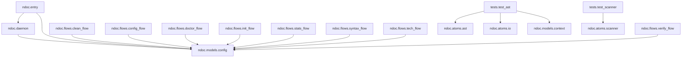

# Dependency Graph
> 最后更新 (Last Updated): 2026-01-29 20:01:48

> Auto-generated by Niki-docAI.

## Module Graph (Internal)

> **Note**: Detailed per-file dependencies (Raw Imports) have been moved to local `_AI.md` files to keep this view clean.
