# Dependency Graph
> 最后更新 (Last Updated): 2026-01-30 23:27:47

> Auto-generated by Niki-docAI.

## Module Graph (Internal)

```mermaid
graph TD
    ndoc.daemon --> ndoc.flows.context_flow
    ndoc.daemon --> ndoc.flows.data_flow
    ndoc.daemon --> ndoc.flows.map_flow
    ndoc.daemon --> ndoc.flows.symbols_flow
    ndoc.daemon --> ndoc.flows.tech_flow
    ndoc.daemon --> ndoc.flows.todo_flow
    ndoc.daemon --> ndoc.models.config
    ndoc.entry --> ndoc.atoms.io
    ndoc.entry --> ndoc.daemon
    ndoc.entry --> ndoc.flows.archive_flow
    ndoc.entry --> ndoc.flows.clean_flow
    ndoc.entry --> ndoc.flows.config_flow
    ndoc.entry --> ndoc.flows.context_flow
    ndoc.entry --> ndoc.flows.data_flow
    ndoc.entry --> ndoc.flows.deps_flow
    ndoc.entry --> ndoc.flows.doctor_flow
    ndoc.entry --> ndoc.flows.init_flow
    ndoc.entry --> ndoc.flows.map_flow
    ndoc.entry --> ndoc.flows.plan_flow
    ndoc.entry --> ndoc.flows.stats_flow
    ndoc.entry --> ndoc.flows.symbols_flow
    ndoc.entry --> ndoc.flows.syntax_flow
    ndoc.entry --> ndoc.flows.tech_flow
    ndoc.entry --> ndoc.flows.todo_flow
    ndoc.entry --> ndoc.flows.update_flow
    ndoc.entry --> ndoc.flows.verify_flow
    ndoc.entry --> ndoc.models.config
    ndoc.flows.clean_flow --> ndoc.models.config
    ndoc.flows.config_flow --> ndoc.atoms.io
    ndoc.flows.config_flow --> ndoc.models.config
    ndoc.flows.doctor_flow --> ndoc.models.config
    ndoc.flows.init_flow --> ndoc.flows.config_flow
    ndoc.flows.init_flow --> ndoc.flows.syntax_flow
    ndoc.flows.init_flow --> ndoc.models.config
    ndoc.flows.stats_flow --> ndoc.atoms.io
    ndoc.flows.stats_flow --> ndoc.models.config
    ndoc.flows.syntax_flow --> ndoc.atoms.io
    ndoc.flows.syntax_flow --> ndoc.models.config
    ndoc.flows.tech_flow --> ndoc.atoms.deps
    ndoc.flows.tech_flow --> ndoc.atoms.io
    ndoc.flows.tech_flow --> ndoc.models.config
    ndoc.flows.verify_flow --> ndoc.models.config
    test_python_fix --> ndoc.atoms.ast
    tests.test_ast --> ndoc.atoms.ast
    tests.test_ast --> ndoc.atoms.io
    tests.test_ast --> ndoc.models.context
    tests.test_scanner --> ndoc.atoms.scanner
```

> **Note**: Detailed per-file dependencies (Raw Imports) have been moved to local `_AI.md` files to keep this view clean.
