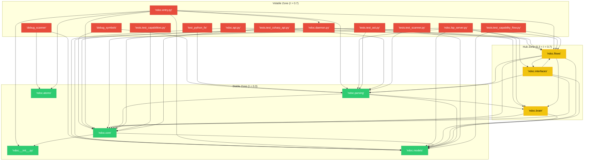

# Dependency Graph
> @CONTEXT: Dependencies | Graph
> 最后更新 (Last Updated): 2026-02-26 12:27:44

## 1. Instability Metrics
| Module | Ca (In) | Ce (Out) | Instability (I) | Role |
| :--- | :---: | :---: | :---: | :--- |
| `ndoc.__init__.py` | 2 | 0 | **0.00** | Foundation |
| `ndoc.atoms` | 2 | 0 | **0.00** | Foundation |
| `ndoc.models` | 12 | 0 | **0.00** | Foundation |
| `ndoc.core` | 11 | 2 | **0.15** | Foundation |
| `ndoc.parsing` | 9 | 3 | **0.25** | Foundation |
| `ndoc.brain` | 4 | 2 | **0.33** | Hub |
| `ndoc.flows` | 6 | 5 | **0.45** | Hub |
| `ndoc.interfaces` | 2 | 4 | **0.67** | Hub |
| `ndoc.daemon.py` | 1 | 4 | **0.80** | Volatile |
| `ndoc.entry.py` | 0 | 7 | **1.00** | Volatile |
| `tests.test_ast.py` | 0 | 3 | **1.00** | Volatile |
| `tests.test_capabilities.py` | 0 | 1 | **1.00** | Volatile |
| `test_python_fix` | 0 | 1 | **1.00** | Volatile |
| `ndoc.api.py` | 0 | 2 | **1.00** | Volatile |
| `tests.test_scanner.py` | 0 | 1 | **1.00** | Volatile |
| `debug_symbols` | 0 | 2 | **1.00** | Volatile |
| `ndoc.lsp_server.py` | 0 | 6 | **1.00** | Volatile |
| `debug_scanner` | 0 | 2 | **1.00** | Volatile |
| `tests.test_capability_flow.py` | 0 | 2 | **1.00** | Volatile |
| `tests.test_csharp_api.py` | 0 | 2 | **1.00** | Volatile |

## 2. Layered Topology

```mermaid
graph TD
    classDef stable fill:#2ecc71,stroke:#27ae60,color:white;
    classDef hub fill:#f1c40f,stroke:#f39c12,color:black;
    classDef volatile fill:#e74c3c,stroke:#c0392b,color:white;
    subgraph "Volatile Zone (I > 0.7)"
        ndoc_entry_py['ndoc.entry.py']:::volatile
        tests_test_ast_py['tests.test_ast.py']:::volatile
        tests_test_capabilities_py['tests.test_capabilities.py']:::volatile
        test_python_fix['test_python_fix']:::volatile
        ndoc_daemon_py['ndoc.daemon.py']:::volatile
        ndoc_api_py['ndoc.api.py']:::volatile
        tests_test_scanner_py['tests.test_scanner.py']:::volatile
        debug_symbols['debug_symbols']:::volatile
        ndoc_lsp_server_py['ndoc.lsp_server.py']:::volatile
        debug_scanner['debug_scanner']:::volatile
        tests_test_capability_flow_py['tests.test_capability_flow.py']:::volatile
        tests_test_csharp_api_py['tests.test_csharp_api.py']:::volatile
    end
    subgraph "Hub Zone (0.3 < I < 0.7)"
        ndoc_interfaces['ndoc.interfaces']:::hub
        ndoc_flows['ndoc.flows']:::hub
        ndoc_brain['ndoc.brain']:::hub
    end
    subgraph "Stable Zone (I < 0.3)"
        ndoc___init___py['ndoc.__init__.py']:::stable
        ndoc_core['ndoc.core']:::stable
        ndoc_parsing['ndoc.parsing']:::stable
        ndoc_atoms['ndoc.atoms']:::stable
        ndoc_models['ndoc.models']:::stable
    end
    debug_scanner --> ndoc_models
    debug_scanner --> ndoc_atoms
    debug_symbols --> ndoc_parsing
    debug_symbols --> ndoc_core
    test_python_fix --> ndoc_parsing
    ndoc_api_py --> ndoc_flows
    ndoc_api_py --> ndoc_models
    ndoc_daemon_py --> ndoc_models
    ndoc_daemon_py --> ndoc_flows
    ndoc_daemon_py --> ndoc_core
    ndoc_daemon_py --> ndoc_brain
    ndoc_entry_py --> ndoc_flows
    ndoc_entry_py --> ndoc___init___py
    ndoc_entry_py --> ndoc_atoms
    ndoc_entry_py --> ndoc_daemon_py
    ndoc_entry_py --> ndoc_models
    ndoc_entry_py --> ndoc_core
    ndoc_entry_py --> ndoc_parsing
    ndoc_lsp_server_py --> ndoc_interfaces
    ndoc_lsp_server_py --> ndoc_flows
    ndoc_lsp_server_py --> ndoc_brain
    ndoc_lsp_server_py --> ndoc_core
    ndoc_lsp_server_py --> ndoc_models
    ndoc_lsp_server_py --> ndoc_parsing
    ndoc_brain --> ndoc_models
    ndoc_brain --> ndoc_core
    ndoc_core --> ndoc_models
    ndoc_core --> ndoc___init___py
    ndoc_flows --> ndoc_interfaces
    ndoc_flows --> ndoc_brain
    ndoc_flows --> ndoc_models
    ndoc_flows --> ndoc_core
    ndoc_flows --> ndoc_parsing
    ndoc_interfaces --> ndoc_models
    ndoc_interfaces --> ndoc_flows
    ndoc_interfaces --> ndoc_parsing
    ndoc_interfaces --> ndoc_core
    ndoc_parsing --> ndoc_models
    ndoc_parsing --> ndoc_brain
    ndoc_parsing --> ndoc_core
    tests_test_ast_py --> ndoc_models
    tests_test_ast_py --> ndoc_parsing
    tests_test_ast_py --> ndoc_core
    tests_test_capabilities_py --> ndoc_core
    tests_test_capability_flow_py --> ndoc_flows
    tests_test_capability_flow_py --> ndoc_models
    tests_test_csharp_api_py --> ndoc_parsing
    tests_test_csharp_api_py --> ndoc_core
    tests_test_scanner_py --> ndoc_parsing
```

## 3. Dependency Matrix
| From \ To | debug_scanner | debug_symbols | py | py | atoms | brain | core | py | py | flows | interfaces | py | models | parsing | test_python_fix | py | py | py | py | py |
| :--- | :---: | :---: | :---: | :---: | :---: | :---: | :---: | :---: | :---: | :---: | :---: | :---: | :---: | :---: | :---: | :---: | :---: | :---: | :---: | :---: |
| **debug_scanner** | · |   |   |   | X |   |   |   |   |   |   |   | X |   |   |   |   |   |   |   |
| **debug_symbols** |   | · |   |   |   |   | X |   |   |   |   |   |   | X |   |   |   |   |   |   |
| **py** |   |   | · |   |   |   |   |   |   |   |   |   |   |   |   |   |   |   |   |   |
| **py** |   |   |   | · |   |   |   |   |   | X |   |   | X |   |   |   |   |   |   |   |
| **atoms** |   |   |   |   | · |   |   |   |   |   |   |   |   |   |   |   |   |   |   |   |
| **brain** |   |   |   |   |   | · | X |   |   |   |   |   | X |   |   |   |   |   |   |   |
| **core** |   |   | X |   |   |   | · |   |   |   |   |   | X |   |   |   |   |   |   |   |
| **py** |   |   |   |   |   | X | X | · |   | X |   |   | X |   |   |   |   |   |   |   |
| **py** |   |   | X |   | X |   | X | X | · | X |   |   | X | X |   |   |   |   |   |   |
| **flows** |   |   |   |   |   | X | X |   |   | · | X |   | X | X |   |   |   |   |   |   |
| **interfaces** |   |   |   |   |   |   | X |   |   | X | · |   | X | X |   |   |   |   |   |   |
| **py** |   |   |   |   |   | X | X |   |   | X | X | · | X | X |   |   |   |   |   |   |
| **models** |   |   |   |   |   |   |   |   |   |   |   |   | · |   |   |   |   |   |   |   |
| **parsing** |   |   |   |   |   | X | X |   |   |   |   |   | X | · |   |   |   |   |   |   |
| **test_python_fix** |   |   |   |   |   |   |   |   |   |   |   |   |   | X | · |   |   |   |   |   |
| **py** |   |   |   |   |   |   | X |   |   |   |   |   | X | X |   | · |   |   |   |   |
| **py** |   |   |   |   |   |   | X |   |   |   |   |   |   |   |   |   | · |   |   |   |
| **py** |   |   |   |   |   |   |   |   |   | X |   |   | X |   |   |   |   | · |   |   |
| **py** |   |   |   |   |   |   | X |   |   |   |   |   |   | X |   |   |   |   | · |   |
| **py** |   |   |   |   |   |   |   |   |   |   |   |   |   | X |   |   |   |   |   | · |

---
*Generated by Niki-docAI*
