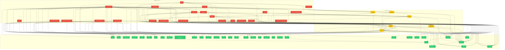

# Dependency Analysis
> @CONTEXT: Architecture & Dependencies | @TAGS: @DEPS
> 最后更新 (Last Updated): 2026-02-27 18:00:27

## 1. Instability Metrics (Core Modules)
| Module | Ca (In) | Ce (Out) | Instability (I) | Role |
| :--- | :---: | :---: | :---: | :--- |
| `sys` | 7 | 0 | **0.00** | Foundation |
| `time` | 4 | 0 | **0.00** | Foundation |
| `child_process` | 1 | 0 | **0.00** | Foundation |
| `setuptools` | 1 | 0 | **0.00** | Foundation |
| `logging` | 2 | 0 | **0.00** | Foundation |
| `datetime` | 2 | 0 | **0.00** | Foundation |
| `os` | 5 | 0 | **0.00** | Foundation |
| `path` | 1 | 0 | **0.00** | Foundation |
| `PyInstaller` | 1 | 0 | **0.00** | Foundation |
| `vscode-languageclient.node` | 1 | 0 | **0.00** | Foundation |
| `System` | 1 | 0 | **0.00** | Foundation |
| `json` | 3 | 0 | **0.00** | Foundation |
| `collections` | 3 | 0 | **0.00** | Foundation |
| `dataclasses` | 5 | 0 | **0.00** | Foundation |
| `typing` | 6 | 0 | **0.00** | Foundation |
| `ndoc.__init__.py` | 4 | 0 | **0.00** | Foundation |
| `root` | 4 | 0 | **0.00** | Foundation |
| `shutil` | 2 | 0 | **0.00** | Foundation |
| `urllib` | 1 | 0 | **0.00** | Foundation |
| `difflib` | 2 | 0 | **0.00** | Foundation |
| `hashlib` | 2 | 0 | **0.00** | Foundation |
| `pathspec` | 2 | 0 | **0.00** | Foundation |
| `re` | 2 | 0 | **0.00** | Foundation |
| `subprocess` | 3 | 0 | **0.00** | Foundation |
| `fs` | 1 | 0 | **0.00** | Foundation |
| `threading` | 1 | 0 | **0.00** | Foundation |
| `enum` | 2 | 0 | **0.00** | Foundation |
| `sqlite3` | 2 | 0 | **0.00** | Foundation |
| `tree_sitter` | 1 | 0 | **0.00** | Foundation |
| `vscode` | 1 | 0 | **0.00** | Foundation |
| `pathlib` | 10 | 0 | **0.00** | Foundation |
| `inspect` | 2 | 0 | **0.00** | Foundation |
| `ndoc.models` | 17 | 3 | **0.15** | Foundation |
| `ndoc.parsing` | 12 | 3 | **0.20** | Foundation |
| `ndoc.sdk` | 3 | 1 | **0.25** | Foundation |
| `ndoc.interfaces` | 5 | 3 | **0.38** | Hub |
| `ndoc.kernel` | 3 | 2 | **0.40** | Hub |
| `ndoc.flows` | 7 | 5 | **0.42** | Hub |
| `ndoc.core` | 15 | 18 | **0.55** | Hub |
| `ndoc.entry.py` | 3 | 4 | **0.57** | Hub |
| `ndoc.brain` | 5 | 8 | **0.62** | Hub |
| `ndoc.views` | 2 | 5 | **0.71** | Volatile |
| `ndoc.daemon.py` | 2 | 6 | **0.75** | Volatile |
| `ndoc.plugins` | 2 | 7 | **0.78** | Volatile |
| `ndoc.services` | 1 | 6 | **0.86** | Volatile |
| `tools.packaging` | 0 | 4 | **1.00** | Volatile |
| `setup` | 0 | 1 | **1.00** | Volatile |
| `ndoc.__main__.py` | 0 | 1 | **1.00** | Volatile |
| `samples.sample_csharp.cs` | 0 | 1 | **1.00** | Volatile |
| `ndoc.cli` | 0 | 11 | **1.00** | Volatile |
| `ndoc.api.py` | 0 | 2 | **1.00** | Volatile |
| `editors.vscode` | 0 | 32 | **1.00** | Volatile |
| `ndoc.lsp_server.py` | 0 | 6 | **1.00** | Volatile |

## 2. Core Architecture (Aggregated)
> Showing only core business modules. Tests and debug tools are hidden.

```mermaid
graph TD
    classDef stable fill:#2ecc71,stroke:#27ae60,color:white;
    classDef hub fill:#f1c40f,stroke:#f39c12,color:black;
    classDef volatile fill:#e74c3c,stroke:#c0392b,color:white;
    subgraph "Volatile Zone (I > 0.7)"
        tests_fixtures['tests.fixtures']:::volatile
        tests_test_lsp_server_py['tests.test_lsp_server.py']:::volatile
        ndoc_services['services']:::volatile
        ndoc_daemon_py['daemon.py']:::volatile
        tests_test_scanner_py['tests.test_scanner.py']:::volatile
        tests_test_capability_flow_py['tests.test_capability_flow.py']:::volatile
        tests_conftest_py['tests.conftest.py']:::volatile
        tools_packaging['tools.packaging']:::volatile
        setup['setup']:::volatile
        ndoc___main___py['__main__.py']:::volatile
        scripts_add_context_marker_py['scripts.add_context_marker.py']:::volatile
        samples_sample_csharp_cs['samples.sample_csharp.cs']:::volatile
        ndoc_cli['cli']:::volatile
        tests_test_csharp_api_py['tests.test_csharp_api.py']:::volatile
        ndoc_api_py['api.py']:::volatile
        tests_test_capabilities_py['tests.test_capabilities.py']:::volatile
        editors_vscode['editors.vscode']:::volatile
        tests_test_ast_py['tests.test_ast.py']:::volatile
        tests_benchmark_e2e_py['tests.benchmark_e2e.py']:::volatile
        ndoc_plugins['plugins']:::volatile
        ndoc_lsp_server_py['lsp_server.py']:::volatile
        scripts_bootstrap_py['scripts.bootstrap.py']:::volatile
        ndoc_views['views']:::volatile
    end
    subgraph "Hub Zone (0.3 < I < 0.7)"
        ndoc_brain['brain']:::hub
        ndoc_entry_py['entry.py']:::hub
        ndoc_kernel['kernel']:::hub
        ndoc_core['core']:::hub
        ndoc_flows['flows']:::hub
        ndoc_interfaces['interfaces']:::hub
    end
    subgraph "Stable Zone (I < 0.3)"
        sys['sys']:::stable
        time['time']:::stable
        child_process['child_process']:::stable
        setuptools['setuptools']:::stable
        logging['logging']:::stable
        datetime['datetime']:::stable
        os['os']:::stable
        ndoc_sdk['sdk']:::stable
        path['path']:::stable
        PyInstaller['PyInstaller']:::stable
        vscode_languageclient_node['vscode-languageclient.node']:::stable
        System['System']:::stable
        json['json']:::stable
        collections['collections']:::stable
        dataclasses['dataclasses']:::stable
        typing['typing']:::stable
        ndoc___init___py['__init__.py']:::stable
        root['root']:::stable
        shutil['shutil']:::stable
        urllib['urllib']:::stable
        difflib['difflib']:::stable
        hashlib['hashlib']:::stable
        pathspec['pathspec']:::stable
        re['re']:::stable
        subprocess['subprocess']:::stable
        fs['fs']:::stable
        threading['threading']:::stable
        enum['enum']:::stable
        ndoc_models['models']:::stable
        ndoc_parsing['parsing']:::stable
        sqlite3['sqlite3']:::stable
        tree_sitter['tree_sitter']:::stable
        vscode['vscode']:::stable
        pathlib['pathlib']:::stable
        inspect['inspect']:::stable
    end
    editors_vscode --> child_process
    editors_vscode --> collections
    editors_vscode --> dataclasses
    editors_vscode --> datetime
    editors_vscode --> difflib
    editors_vscode --> enum
    editors_vscode --> fs
    editors_vscode --> hashlib
    editors_vscode --> inspect
    editors_vscode --> json
    editors_vscode --> logging
    editors_vscode --> ndoc___init___py
    editors_vscode --> ndoc_brain
    editors_vscode --> ndoc_core
    editors_vscode --> ndoc_daemon_py
    editors_vscode --> ndoc_entry_py
    editors_vscode --> ndoc_flows
    editors_vscode --> ndoc_interfaces
    editors_vscode --> ndoc_models
    editors_vscode --> ndoc_parsing
    editors_vscode --> os
    editors_vscode --> path
    editors_vscode --> pathlib
    editors_vscode --> pathspec
    editors_vscode --> re
    editors_vscode --> root
    editors_vscode --> sqlite3
    editors_vscode --> sys
    editors_vscode --> time
    editors_vscode --> typing
    editors_vscode --> vscode
    editors_vscode --> vscode_languageclient_node
    ndoc___main___py --> ndoc_entry_py
    ndoc_api_py --> ndoc_flows
    ndoc_api_py --> ndoc_models
    ndoc_brain --> collections
    ndoc_brain --> dataclasses
    ndoc_brain --> enum
    ndoc_brain --> ndoc_core
    ndoc_brain --> ndoc_models
    ndoc_brain --> pathlib
    ndoc_brain --> time
    ndoc_brain --> typing
    ndoc_cli --> ndoc___init___py
    ndoc_cli --> ndoc_core
    ndoc_cli --> ndoc_daemon_py
    ndoc_cli --> ndoc_flows
    ndoc_cli --> ndoc_interfaces
    ndoc_cli --> ndoc_kernel
    ndoc_cli --> ndoc_models
    ndoc_cli --> ndoc_parsing
    ndoc_cli --> ndoc_plugins
    ndoc_cli --> ndoc_services
    ndoc_cli --> root
    ndoc_core --> collections
    ndoc_core --> dataclasses
    ndoc_core --> datetime
    ndoc_core --> difflib
    ndoc_core --> hashlib
    ndoc_core --> inspect
    ndoc_core --> json
    ndoc_core --> logging
    ndoc_core --> ndoc___init___py
    ndoc_core --> ndoc_models
    ndoc_core --> ndoc_parsing
    ndoc_core --> os
    ndoc_core --> pathlib
    ndoc_core --> pathspec
    ndoc_core --> re
    ndoc_core --> sqlite3
    ndoc_core --> sys
    ndoc_core --> typing
    ndoc_daemon_py --> ndoc_brain
    ndoc_daemon_py --> ndoc_core
    ndoc_daemon_py --> ndoc_flows
    ndoc_daemon_py --> ndoc_interfaces
    ndoc_daemon_py --> ndoc_models
    ndoc_daemon_py --> ndoc_parsing
    ndoc_entry_py --> ndoc___init___py
    ndoc_entry_py --> ndoc_core
    ndoc_entry_py --> ndoc_flows
    ndoc_entry_py --> ndoc_models
    ndoc_flows --> ndoc_core
    ndoc_flows --> ndoc_models
    ndoc_flows --> ndoc_parsing
    ndoc_flows --> ndoc_views
    ndoc_flows --> root
    ndoc_interfaces --> ndoc_core
    ndoc_interfaces --> ndoc_models
    ndoc_interfaces --> ndoc_parsing
    ndoc_kernel --> ndoc_plugins
    ndoc_kernel --> ndoc_sdk
    ndoc_lsp_server_py --> ndoc_brain
    ndoc_lsp_server_py --> ndoc_core
    ndoc_lsp_server_py --> ndoc_flows
    ndoc_lsp_server_py --> ndoc_interfaces
    ndoc_lsp_server_py --> ndoc_models
    ndoc_lsp_server_py --> ndoc_parsing
    ndoc_models --> dataclasses
    ndoc_models --> pathlib
    ndoc_models --> typing
    ndoc_parsing --> ndoc_core
    ndoc_parsing --> ndoc_models
    ndoc_parsing --> root
    ndoc_plugins --> ndoc_brain
    ndoc_plugins --> ndoc_core
    ndoc_plugins --> ndoc_kernel
    ndoc_plugins --> ndoc_models
    ndoc_plugins --> ndoc_parsing
    ndoc_plugins --> ndoc_sdk
    ndoc_plugins --> ndoc_views
    ndoc_sdk --> ndoc_models
    ndoc_services --> ndoc_brain
    ndoc_services --> ndoc_core
    ndoc_services --> ndoc_kernel
    ndoc_services --> ndoc_models
    ndoc_services --> ndoc_parsing
    ndoc_services --> ndoc_sdk
    ndoc_views --> ndoc_core
    ndoc_views --> ndoc_interfaces
    ndoc_views --> ndoc_models
    ndoc_views --> pathlib
    ndoc_views --> typing
    samples_sample_csharp_cs --> System
    scripts_add_context_marker_py --> pathlib
    scripts_bootstrap_py --> os
    scripts_bootstrap_py --> pathlib
    scripts_bootstrap_py --> shutil
    scripts_bootstrap_py --> subprocess
    scripts_bootstrap_py --> sys
    scripts_bootstrap_py --> urllib
    setup --> setuptools
    tests_benchmark_e2e_py --> os
    tests_benchmark_e2e_py --> pathlib
    tests_benchmark_e2e_py --> shutil
    tests_benchmark_e2e_py --> subprocess
    tests_benchmark_e2e_py --> sys
    tests_benchmark_e2e_py --> time
    tests_conftest_py --> pathlib
    tests_conftest_py --> sys
    tests_conftest_py --> tree_sitter
    tests_fixtures --> dataclasses
    tests_fixtures --> typing
    tests_test_ast_py --> ndoc_core
    tests_test_ast_py --> ndoc_models
    tests_test_ast_py --> ndoc_parsing
    tests_test_capabilities_py --> ndoc_core
    tests_test_capability_flow_py --> ndoc_flows
    tests_test_capability_flow_py --> ndoc_models
    tests_test_csharp_api_py --> ndoc_core
    tests_test_csharp_api_py --> ndoc_parsing
    tests_test_lsp_server_py --> json
    tests_test_lsp_server_py --> os
    tests_test_lsp_server_py --> subprocess
    tests_test_lsp_server_py --> sys
    tests_test_lsp_server_py --> threading
    tests_test_lsp_server_py --> time
    tests_test_scanner_py --> ndoc_parsing
    tools_packaging --> PyInstaller
    tools_packaging --> ndoc_entry_py
    tools_packaging --> pathlib
    tools_packaging --> sys
```

## 3. Dependency Matrix (Core Modules)
*Matrix omitted due to size (> 50 modules).*

## 4. Full Dependency Graph (Detailed)
> Showing all modules including tests and tools.
*Full graph omitted in Pilot*

> **Note**: This view is aggregated by module/package. Detailed per-file dependencies are available in local `_AI.md` files.

---
*Generated by Niki-docAI*
