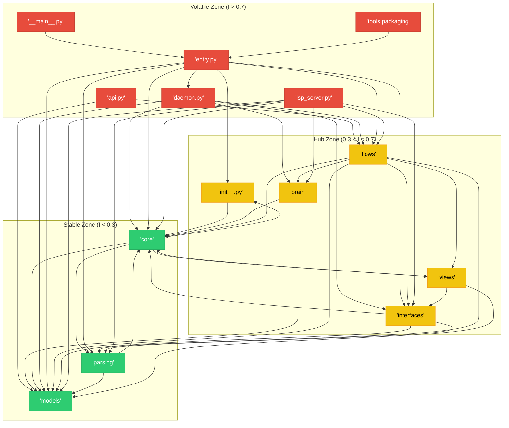
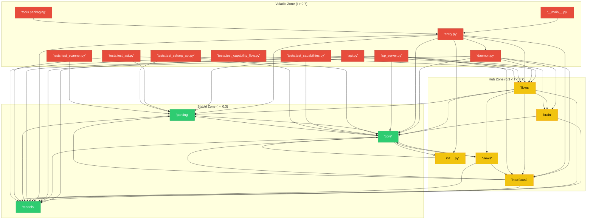

# Dependency Graph
> @CONTEXT: Dependencies | Graph | @TAGS: 
> 最后更新 (Last Updated): 2026-02-26 20:35:12

## 1. Instability Metrics (Core Modules)
| Module | Ca (In) | Ce (Out) | Instability (I) | Role |
| :--- | :---: | :---: | :---: | :--- |
| `ndoc.models` | 12 | 0 | **0.00** | Foundation |
| `ndoc.parsing` | 8 | 2 | **0.20** | Foundation |
| `ndoc.core` | 12 | 4 | **0.25** | Foundation |
| `ndoc.__init__.py` | 2 | 1 | **0.33** | Hub |
| `ndoc.interfaces` | 5 | 3 | **0.38** | Hub |
| `ndoc.brain` | 3 | 2 | **0.40** | Hub |
| `ndoc.flows` | 5 | 6 | **0.55** | Hub |
| `ndoc.views` | 2 | 3 | **0.60** | Hub |
| `ndoc.entry.py` | 2 | 7 | **0.78** | Volatile |
| `ndoc.daemon.py` | 1 | 5 | **0.83** | Volatile |
| `ndoc.lsp_server.py` | 0 | 6 | **1.00** | Volatile |
| `ndoc.api.py` | 0 | 2 | **1.00** | Volatile |
| `ndoc.__main__.py` | 0 | 1 | **1.00** | Volatile |
| `tools.packaging` | 0 | 1 | **1.00** | Volatile |

## ⚠️ Circular Dependencies (File Level)
**Found 1 file-level circular dependencies** (Potential Deadlocks):
   - `bootstrap.py -> __init__.py -> capabilities.py -> bootstrap.py`

## ⚠️ Circular Dependencies (Module Level)
**Found 1 module-level circular dependencies** (Architectural Issues):
   - `ndoc.parsing -> ndoc.__init__.py -> ndoc.core -> ndoc.interfaces -> ndoc.views -> ndoc.parsing`

## 2. Core Architecture (Aggregated)
> Showing only core business modules. Tests and debug tools are hidden.

```mermaid
graph TD
    classDef stable fill:#2ecc71,stroke:#27ae60,color:white;
    classDef hub fill:#f1c40f,stroke:#f39c12,color:black;
    classDef volatile fill:#e74c3c,stroke:#c0392b,color:white;
    subgraph "Volatile Zone (I > 0.7)"
        ndoc_entry_py['entry.py']:::volatile
        ndoc_lsp_server_py['lsp_server.py']:::volatile
        ndoc_api_py['api.py']:::volatile
        ndoc___main___py['__main__.py']:::volatile
        tools_packaging['tools.packaging']:::volatile
        ndoc_daemon_py['daemon.py']:::volatile
    end
    subgraph "Hub Zone (0.3 < I < 0.7)"
        ndoc_views['views']:::hub
        ndoc___init___py['__init__.py']:::hub
        ndoc_flows['flows']:::hub
        ndoc_interfaces['interfaces']:::hub
        ndoc_brain['brain']:::hub
    end
    subgraph "Stable Zone (I < 0.3)"
        ndoc_models['models']:::stable
        ndoc_core['core']:::stable
        ndoc_parsing['parsing']:::stable
    end
    ndoc___init___py --> ndoc_core
    ndoc___main___py --> ndoc_entry_py
    ndoc_api_py --> ndoc_flows
    ndoc_api_py --> ndoc_models
    ndoc_brain --> ndoc_core
    ndoc_brain --> ndoc_models
    ndoc_core --> ndoc___init___py
    ndoc_core --> ndoc_models
    ndoc_core --> ndoc_parsing
    ndoc_core --> ndoc_views
    ndoc_daemon_py --> ndoc_brain
    ndoc_daemon_py --> ndoc_core
    ndoc_daemon_py --> ndoc_flows
    ndoc_daemon_py --> ndoc_interfaces
    ndoc_daemon_py --> ndoc_models
    ndoc_entry_py --> ndoc___init___py
    ndoc_entry_py --> ndoc_core
    ndoc_entry_py --> ndoc_daemon_py
    ndoc_entry_py --> ndoc_flows
    ndoc_entry_py --> ndoc_interfaces
    ndoc_entry_py --> ndoc_models
    ndoc_entry_py --> ndoc_parsing
    ndoc_flows --> ndoc_brain
    ndoc_flows --> ndoc_core
    ndoc_flows --> ndoc_interfaces
    ndoc_flows --> ndoc_models
    ndoc_flows --> ndoc_parsing
    ndoc_flows --> ndoc_views
    ndoc_interfaces --> ndoc_core
    ndoc_interfaces --> ndoc_models
    ndoc_interfaces --> ndoc_parsing
    ndoc_lsp_server_py --> ndoc_brain
    ndoc_lsp_server_py --> ndoc_core
    ndoc_lsp_server_py --> ndoc_flows
    ndoc_lsp_server_py --> ndoc_interfaces
    ndoc_lsp_server_py --> ndoc_models
    ndoc_lsp_server_py --> ndoc_parsing
    ndoc_parsing --> ndoc_core
    ndoc_parsing --> ndoc_models
    ndoc_views --> ndoc_core
    ndoc_views --> ndoc_interfaces
    ndoc_views --> ndoc_models
    tools_packaging --> ndoc_entry_py
```

## 3. Dependency Matrix (Core Modules)
| From \ To | __init__.py | __main__.py | api.py | brain | core | daemon.py | entry.py | flows | interfaces | lsp_server.py | models | parsing | views | tools.packaging |
| :--- | :---: | :---: | :---: | :---: | :---: | :---: | :---: | :---: | :---: | :---: | :---: | :---: | :---: | :---: |
| **__init__.py** | · |   |   |   | X |   |   |   |   |   |   |   |   |   |
| **__main__.py** |   | · |   |   |   |   | X |   |   |   |   |   |   |   |
| **api.py** |   |   | · |   |   |   |   | X |   |   | X |   |   |   |
| **brain** |   |   |   | · | X |   |   |   |   |   | X |   |   |   |
| **core** | X |   |   |   | · |   |   |   |   |   | X | X | X |   |
| **daemon.py** |   |   |   | X | X | · |   | X | X |   | X |   |   |   |
| **entry.py** | X |   |   |   | X | X | · | X | X |   | X | X |   |   |
| **flows** |   |   |   | X | X |   |   | · | X |   | X | X | X |   |
| **interfaces** |   |   |   |   | X |   |   |   | · |   | X | X |   |   |
| **lsp_server.py** |   |   |   | X | X |   |   | X | X | · | X | X |   |   |
| **models** |   |   |   |   |   |   |   |   |   |   | · |   |   |   |
| **parsing** |   |   |   |   | X |   |   |   |   |   | X | · |   |   |
| **views** |   |   |   |   | X |   |   |   | X |   | X |   | · |   |
| **tools.packaging** |   |   |   |   |   |   | X |   |   |   |   |   |   | · |

## 4. Full Graph (All Modules)

Click to expand full graph (including tests & debug tools)

```mermaid
graph TD
    classDef stable fill:#2ecc71,stroke:#27ae60,color:white;
    classDef hub fill:#f1c40f,stroke:#f39c12,color:black;
    classDef volatile fill:#e74c3c,stroke:#c0392b,color:white;
    subgraph "Volatile Zone (I > 0.7)"
        tests_test_scanner_py['tests.test_scanner.py']:::volatile
        ndoc_lsp_server_py['lsp_server.py']:::volatile
        tests_test_capabilities_py['tests.test_capabilities.py']:::volatile
        ndoc_api_py['api.py']:::volatile
        tests_test_ast_py['tests.test_ast.py']:::volatile
        ndoc_daemon_py['daemon.py']:::volatile
        ndoc_entry_py['entry.py']:::volatile
        ndoc___main___py['__main__.py']:::volatile
        tests_test_csharp_api_py['tests.test_csharp_api.py']:::volatile
        tools_packaging['tools.packaging']:::volatile
        tests_test_capability_flow_py['tests.test_capability_flow.py']:::volatile
    end
    subgraph "Hub Zone (0.3 < I < 0.7)"
        ndoc___init___py['__init__.py']:::hub
        ndoc_flows['flows']:::hub
        ndoc_interfaces['interfaces']:::hub
        ndoc_views['views']:::hub
        ndoc_brain['brain']:::hub
    end
    subgraph "Stable Zone (I < 0.3)"
        ndoc_models['models']:::stable
        ndoc_parsing['parsing']:::stable
        ndoc_core['core']:::stable
    end
    ndoc___init___py --> ndoc_core
    ndoc___main___py --> ndoc_entry_py
    ndoc_api_py --> ndoc_flows
    ndoc_api_py --> ndoc_models
    ndoc_brain --> ndoc_core
    ndoc_brain --> ndoc_models
    ndoc_core --> ndoc___init___py
    ndoc_core --> ndoc_models
    ndoc_core --> ndoc_parsing
    ndoc_core --> ndoc_views
    ndoc_daemon_py --> ndoc_brain
    ndoc_daemon_py --> ndoc_core
    ndoc_daemon_py --> ndoc_flows
    ndoc_daemon_py --> ndoc_interfaces
    ndoc_daemon_py --> ndoc_models
    ndoc_entry_py --> ndoc___init___py
    ndoc_entry_py --> ndoc_core
    ndoc_entry_py --> ndoc_daemon_py
    ndoc_entry_py --> ndoc_flows
    ndoc_entry_py --> ndoc_interfaces
    ndoc_entry_py --> ndoc_models
    ndoc_entry_py --> ndoc_parsing
    ndoc_flows --> ndoc_brain
    ndoc_flows --> ndoc_core
    ndoc_flows --> ndoc_interfaces
    ndoc_flows --> ndoc_models
    ndoc_flows --> ndoc_parsing
    ndoc_flows --> ndoc_views
    ndoc_interfaces --> ndoc_core
    ndoc_interfaces --> ndoc_models
    ndoc_interfaces --> ndoc_parsing
    ndoc_lsp_server_py --> ndoc_brain
    ndoc_lsp_server_py --> ndoc_core
    ndoc_lsp_server_py --> ndoc_flows
    ndoc_lsp_server_py --> ndoc_interfaces
    ndoc_lsp_server_py --> ndoc_models
    ndoc_lsp_server_py --> ndoc_parsing
    ndoc_parsing --> ndoc_core
    ndoc_parsing --> ndoc_models
    ndoc_views --> ndoc_core
    ndoc_views --> ndoc_interfaces
    ndoc_views --> ndoc_models
    tests_test_ast_py --> ndoc_core
    tests_test_ast_py --> ndoc_models
    tests_test_ast_py --> ndoc_parsing
    tests_test_capabilities_py --> ndoc_core
    tests_test_capability_flow_py --> ndoc_flows
    tests_test_capability_flow_py --> ndoc_models
    tests_test_csharp_api_py --> ndoc_core
    tests_test_csharp_api_py --> ndoc_parsing
    tests_test_scanner_py --> ndoc_parsing
    tools_packaging --> ndoc_entry_py
```

> **Note**: This view is aggregated by module/package. Detailed per-file dependencies are available in local `_AI.md` files.

---
*Generated by Niki-docAI*
