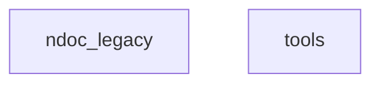

# PROJECT ARCHITECTURE
> @CONTEXT: Dependency Graph | @TAGS: @ARCH @GRAPH
<!-- NIKI_VERSION: 0.1.0 -->

## @GRAPH
> Generated by `ndoc graph`.

<!-- NIKI_AUTO_DOC_START -->

<!-- NIKI_AUTO_DOC_END -->

## @ANALYSIS
*   **Nodes**: Modules.
*   **Edges**: Dependencies (`A --> B`).
